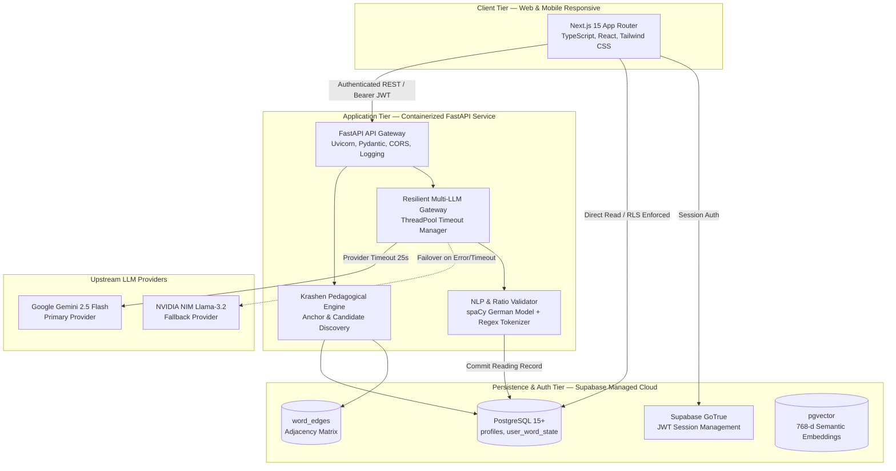

# Drain — Adaptive Domain AI Architecture for Specialized Language Acquisition

[](docs/architecture/system-design.md)
[](docs/product/krashen-engine-spec.md)
[](docs/architecture/adr/ADR-002-multi-llm-resilient-gateway.md)
[](docs/architecture/security-threat-model.md)
[](docs/architecture/token-economics.md)

---

## 1. Executive Summary

**Drain** is an enterprise-grade AI solution engineered to solve high-stakes specialized language acquisition for international professionals preparing for the German Professional Language Examination (*Fachsprachenprüfung*) across **Healthcare (Nursing, Medicine, Physiotherapy, Pharmacy)**, **Information Technology**, and **Academia**.

Unlike traditional flashcard apps that promote isolated rote memorization, or standard generative RAG pipelines that suffer from lexical drift, Drain implements an **Adaptive Pedagogical Graph Engine**. The system algorithmically operationalizes **Stephen Krashen’s Comprehensible Input Hypothesis ($i+1$)** and **Paul Nation’s 95% Lexical Threshold**, guaranteeing that generated reading passages contain ~95% known vocabulary with precisely one unmastered target item ($+1$) embedded in authentic professional context.

```mermaid
graph LR
    subgraph Input [Learner Context]
        U[User Profile & Domain]
        M[Mastery Map: user_word_state]
    end

    subgraph CoreEngine [Drain AI Solution Architecture]
        K[Krashen Pedagogical Engine]
        G[Lexical Knowledge Graph]
        LLM[Resilient Multi-LLM Gateway<br/>Gemini 2.5 Flash + NIM Fallback]
        V[spaCy NLP Evaluator & Ratio Loop]
    end

    subgraph Output [Delivered Experience]
        R[CEFR-Calibrated Professional Reading Passage<br/>95% Known / 5% Novel Target Word]
    end

    U & M --> K
    K <--> G
    K -->|Assembled Prompt| LLM
    LLM -->|Candidate Passage| V
    V -->|Validated (Unknown <= 5%)| R
    V -.->|Retry if Drift > 5%| LLM
```

---

## 2. Key Architecture Pillars

| Architectural Pillar | Technical Realization | Key Design Decision |
|---|---|---|
| **Adaptive Pedagogical AI** | Directed Knowledge Graph traversal (`word_edges`) + closed-loop spaCy lemmatizer unknown-ratio validation ($\le 5\%$). | [ADR-001](docs/architecture/adr/ADR-001-graph-guided-krashen-engine.md) |
| **Resilient Multi-LLM Gateway** | Primary Google Gemini 2.5 Flash with zero-downtime fallback to NVIDIA NIM (Llama 3.2), bounded by thread-isolated timeout budgets. | [ADR-002](docs/architecture/adr/ADR-002-multi-llm-resilient-gateway.md) |
| **Hybrid Data Architecture** | Unified PostgreSQL engine hosting relational user state, graph adjacency pairs, and `pgvector` (768-d) semantic embeddings. | [ADR-003](docs/architecture/adr/ADR-003-hybrid-graph-relational-vector-datastore.md) |
| **Zero-Trust Security Boundary** | Strict client/server demarcation: Frontend restricted to public anon key with Row Level Security (RLS); state mutations isolated to backend service role. | [ADR-004](docs/architecture/adr/ADR-004-zero-trust-rls-security-boundary.md) |
| **Cost & Token Economics** | Compact few-shot prompt architecture achieving **$< \$0.007$ total inference cost per active user/month** at sub-2s p95 latency. | [Token Economics](docs/architecture/token-economics.md) |

---

## 3. End-to-End System Architecture (C4 Container View)



---

## 4. Architecture Decision Records (ADRs)

Every foundational technical decision is formally documented:

* **[ADR-001: Graph-Guided Vocabulary Traversal vs Pure Vector RAG](docs/architecture/adr/ADR-001-graph-guided-krashen-engine.md)**  
  *Solves lexical hallucination and cognitive overload by using a directed knowledge graph instead of unconstrained semantic vector retrieval.*
* **[ADR-002: Multi-LLM Gateway & Resilience Strategy](docs/architecture/adr/ADR-002-multi-llm-resilient-gateway.md)**  
  *Implements primary (Gemini 2.5 Flash) and secondary (NVIDIA NIM) routing with thread pool timeout bounds (`PROVIDER_TIMEOUT=25s`, `CHAIN_TIMEOUT=45s`) to achieve 99.9% uptime.*
* **[ADR-003: Hybrid Data Architecture (Relational + Graph + pgvector)](docs/architecture/adr/ADR-003-hybrid-graph-relational-vector-datastore.md)**  
  *Eliminates multi-database sync complexity by consolidating relational progress, graph adjacency, and semantic embeddings into a single managed PostgreSQL cluster.*
* **[ADR-004: Defense-in-Depth Security Boundary (Postgres RLS + Backend Proxy)](docs/architecture/adr/ADR-004-zero-trust-rls-security-boundary.md)**  
  *Guarantees zero-leakage multi-tenancy and prevents client-side mastery score manipulation via strict Row-Level Security policies and backend service role isolation.*

---

## 5. Token Economics & Cost Breakdown

| Metric | Google Gemini 2.5 Flash | NVIDIA NIM (Llama 3.2 11B) | Blended Architecture |
|---|---|---|---|
| **Input Price / 1M Tokens** | $\$0.075$ | $\$0.100$ | — |
| **Output Price / 1M Tokens** | $\$0.300$ | $\$0.200$ | — |
| **Cost per Generation (~320 in / 120 out)** | $\$0.000060$ | $\$0.000056$ | **$\$0.000061$** |
| **Monthly Cost per Active User (90 texts/mo)** | $\$0.0054$ | $\$0.0050$ | **$\mathbf{\$0.00675}$** ($< 1\text{ cent}$) |
| **Projected Monthly Infra Cost (10k DAU)** | — | — | **$\$117.50$** (incl. DB compute) |

👉 *Full mathematical modeling and 1k–1M DAU scale projections available in the [Token Economics Blueprint](docs/architecture/token-economics.md).*

---

## 6. Domain Taxonomy & Coverage

Drain provides specialized curriculum paths with domain-curated vocabulary graphs:

```
├── HEALTH (Fachsprachenprüfung Healthcare)
│   ├── PFLEGE (Nursing: shift handover, wound care, vitals, crisis communication)
│   ├── MEDIZIN (Physicians: Anamnesis, clinical rounds, surgery prep, diagnostics)
│   ├── PHYSIOTHERAPIE (Physical Therapy: rehab plans, mobilization, gait analysis)
│   └── PHARMAZIE (Pharmacy: contraindications, prescription review, patient advice)
├── IT (Software & Systems Engineering)
│   └── Architecture reviews, sprint planning, server outages, API specifications
├── ACADEMIC (DSH / TestDaF / University Studies)
│   └── Seminar debates, research colloquia, thesis feedback, methodology
└── CORE (Universal CEFR Foundation A1–B1)
    └── Goethe & Telc reference vocabulary serving as structural anchor points
```

---

## 7. Technology Stack

| Layer | Technologies | Purpose |
|---|---|---|
| **Frontend UI** | Next.js 15, React 19, TypeScript, Tailwind CSS | High-performance responsive web client |
| **Backend Gateway** | Python 3.12, FastAPI, Uvicorn, Pydantic | Asynchronous REST microservice & orchestration |
| **AI / LLM Ingestion** | Google GenAI SDK (`gemini-2.5-flash`), NVIDIA NIM (`meta/llama-3.2`) | Context-constrained natural text generation |
| **NLP & Lemmatization** | spaCy (`de_core_news_sm`), regex tokenizers | German lemma extraction & unknown ratio validation |
| **Database & Vector** | PostgreSQL 15+, `pgvector`, Supabase Managed | Relational mastery state, graph edges, embeddings |
| **Auth & Security** | Supabase GoTrue, PostgreSQL RLS, Bearer JWTs | Identity verification & cryptographic tenant isolation |

---

## 8. Repository Structure

```
drain/
├── backend/                  # FastAPI Python microservice
│   ├── app/
│   │   ├── api/endpoints/    # Onboarding, reading, and pipeline endpoints
│   │   ├── core/             # Configuration, logging, Supabase admin client
│   │   ├── models/           # Pydantic domain and schema definitions
│   │   ├── pipeline/         # spaCy lemmatizer & vocabulary ingestion
│   │   ├── services/         # Krashen pedagogical engine & multi-LLM gateway
│   │   └── main.py           # Application entrypoint
│   └── Dockerfile            # Production container configuration
├── frontend/                 # Next.js 15 web application
│   ├── src/app/              # Next.js App Router pages and layouts
│   ├── src/components/       # UI components (Reader, Onboarding, Navigation)
│   └── package.json          # Node dependencies
├── docs/                     # Comprehensive Architecture Documentation
│   ├── architecture/
│   │   ├── system-design.md          # Full C4 architecture & sequence diagrams
│   │   ├── token-economics.md        # Cost, token budgeting & scale projections
│   │   ├── security-threat-model.md  # STRIDE threat analysis & RLS matrix
│   │   └── adr/                      # Architecture Decision Records (001–004)
│   └── product/
│       └── krashen-engine-spec.md    # Pedagogical theory to algorithmic mappings
└── archive/                  # Historical internal notes & reference documents
```

---

## 9. Quickstart & Local Development

### Prerequisites
- Python 3.12+
- Node.js 20+
- Supabase account (or local Supabase CLI instance)
- Google Gemini API Key and/or NVIDIA NIM API Key

### Backend Setup
```bash
cd backend
python -m venv venv
source venv/bin/activate
pip install -r requirements.txt
python -m spacy download de_core_news_sm

# Configure environment variables
cp .env.example .env

# Run development server
uvicorn app.main:app --reload --port 8000
```

### Frontend Setup
```bash
cd frontend
npm install
cp .env.example .env.local
npm run dev
```

Visit `http://localhost:3000` to interact with the application.
Interactive OpenAPI Swagger docs available at `http://localhost:8000/docs`.

---

## 10. Engineering Documentation Index

- 📘 **[System Architecture & Design Document](docs/architecture/system-design.md)**
- 📐 **[Architecture Decision Records (ADRs)](docs/architecture/adr/)**
- 💰 **[Token Economics & Scale Projections](docs/architecture/token-economics.md)**
- 🛡️ **[Security Architecture & STRIDE Threat Model](docs/architecture/security-threat-model.md)**
- 🧠 **[Krashen Engine & Pedagogical Spec](docs/product/krashen-engine-spec.md)**
