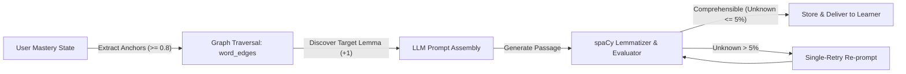

# ADR-001: Graph-Guided Vocabulary Traversal vs Pure Vector RAG for Pedagogical Generation

## Status
**Accepted**

## Context
Language acquisition theory, particularly Stephen Krashen’s **Comprehensible Input Hypothesis ($i+1$)** and Paul Nation’s **95% Known-Vocabulary Threshold**, dictates that optimal language acquisition occurs when learners comprehend roughly 95–98% of the lexical items in a passage while being challenged by 2–5% novel target items ($+1$).

In domain-specific German learning (e.g., *Fachsprachenprüfung* for Healthcare, Nursing, IT, and Academia), standard text generation and pure Vector-based Retrieval-Augmented Generation (RAG) suffer from three critical architectural flaws:
1. **Uncontrolled Lexical Drift**: Semantic vector search retrieves contextually similar passages, but embedding proximity does not correlate with a learner’s exact individualized vocabulary mastery state.
2. **Lexical Overload (Cognitive Dissonance)**: Generative LLMs prompted with standard domain instructions produce unconstrained terminology, driving the unknown word ratio above 20–30%, which breaks the comprehensible input threshold.
3. **Lack of Prerequisite Scaffolding**: Medical and technical terminology forms conceptual dependency chains (e.g., *Inzidenz* $\rightarrow$ *Prävalenz* $\rightarrow$ *Epidemiologie*). Vector similarity cannot enforce prerequisite ordering.

## Decision
We implemented a **Graph-Constrained Closed-Loop Generation Engine** that combines:
1. **User Mastery State Extraction**: Identifying verified high-mastery anchor words ($\text{Mastery} \ge 0.80$).
2. **Knowledge Graph Traversal (`word_edges`)**: Discovering target candidates via directed relationship semantics (`PREREQUISITE_FOR`, `USED_IN_SCENARIO`, `OFTEN_CO_OCCURS_WITH`, `CAUSES`).
3. **Constrained Few-Shot Prompting**: Supplying anchor anchors, exact target lemma, strict sentence count, and CEFR grammar constraints.
4. **Closed-Loop Lemmatization & Ratio Validation**: Passing generated text through a spaCy lemmatization and regex token validator to guarantee $\text{Unknown Ratio} \le 5\%$, triggering an automatic single-retry regeneration loop if validation thresholds are breached.

## Consequences

### Positive
- **Guaranteed Pedagogical Integrity**: The unknown word ratio is mathematically bounded, ensuring learners are never overwhelmed.
- **Explainability**: Every generated text has clear provenance: `anchor_word_id`, `target_word_id`, and `unknown_ratio` stored in the database.
- **Zero Translation Dependence**: Learners acquire vocabulary strictly via German-only contextual comprehension (*Direct Method*).

### Negative / Trade-offs
- **Graph Curation Overhead**: Requires curated directed edges between vocabulary nodes.
- **Generation Latency Overhead**: Closed-loop validation introduces parsing overhead (~15–30ms) and occasional retry latency.

### Mitigations
- Automated edge extraction pipeline with human-in-the-loop curation for domain glossaries.
- Strict token budget and single-retry cap ($\text{max\_retries}=1$) to keep total p95 response time under 3.5 seconds.
