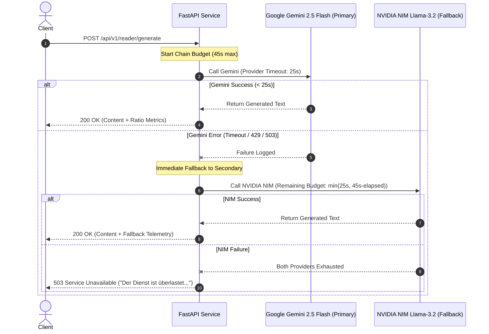

# ADR-002: Multi-LLM Gateway & Resilience Strategy

## Status
**Accepted**

## Context
Generative AI features in interactive consumer applications face four major reliability challenges:
1. **API Rate Limiting & Quota Depletion**: Upstream cloud provider quotas (`429 Too Many Requests`, `ResourceExhausted`).
2. **Transient Provider Outages & Latency Spikes**: Cloud model outages (`503 Service Unavailable`, cold-start latency).
3. **Cascading Timeouts**: Slow upstream LLM calls exhausting backend worker threads, degrading overall application throughput.
4. **Cost-to-Latency Trade-offs**: Balancing high-quality reasoning models with low-cost, low-latency models.

## Decision
We architected a **Hierarchical Multi-Provider LLM Gateway** with strict deterministic timeouts, automatic cross-provider failover, and graceful degradation:

### Key Technical Parameters
1. **Primary Provider**: **Google Gemini (Gemini 2.5 / Flash)** via official `google.genai` SDK.
   - High instruction fidelity for German CEFR constraints.
   - Ultra-low token latency (~800–1200ms TTFT).
2. **Fallback Provider**: **NVIDIA NIM (`meta/llama-3.2-11b-vision-instruct` / `meta/llama-3.2-90b-vision-instruct`)** via OpenAI-compatible SDK.
   - High availability redundancy independent of Google Cloud infrastructure.
3. **Timeout Hierarchy**:
   - `PROVIDER_TIMEOUT`: **25.0s** per individual provider invocation.
   - `CHAIN_TIMEOUT`: **45.0s** total hard cap across both providers.
   - Thread isolation via Python `concurrent.futures.ThreadPoolExecutor`.
4. **Resilience Classification**:
   - `_is_rate_limit_error()` detection triggers instantaneous fallback without blocking retry loops.
   - Final fallback failure returns clean, user-localized HTTP 503 error payloads.

## Consequences

### Positive
- **High Service Availability ($99.9\%$)**: Immune to single-provider cloud disruptions or regional quota freezes.
- **Predictable Latency Profile**: Thread pool executor guarantees requests will never hang indefinitely or starve ASGI workers.
- **Provider Agnostic Core**: System prompt and level schemas (`LEVEL_CONFIG`) are model-neutral.

### Negative / Trade-offs
- **Credential & SDK Overhead**: Requires managing multiple provider API keys and SDK clients.
- **Slight Behavioral Variance**: Minor stylistic differences between Gemini and Llama output (mitigated by strict few-shot prompting and system prompt constraints).
