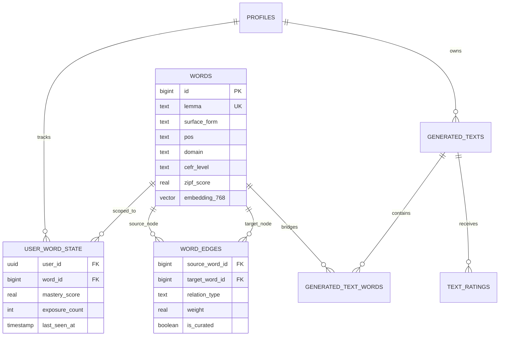

# ADR-003: Hybrid Data Architecture — Relational + Graph Edges + pgvector

## Status
**Accepted**

## Context
Drain requires a persistent data layer capable of concurrently supporting three distinct access patterns:
1. **Relational User State**: High-frequency transactional updates for user profiles, mastery tracking, and reading histories.
2. **Knowledge Graph Traversal**: Relational graph representation for directional pedagogical dependencies between vocabulary lemmas (e.g. `PREREQUISITE_FOR`, `USED_IN_SCENARIO`).
3. **Semantic Vector Search**: Vector embedding storage for contextual similarity, cluster analysis, and semantic distance matching.

### Alternatives Considered
- **Option A: Dedicated Graph DB (Neo4j) + Vector DB (Pinecone/Qdrant) + Relational DB (PostgreSQL)**:
  - *Drawback*: Extreme operational complexity, multi-database distributed transactions, sync latency, high infrastructure cost for an early-to-mid stage architecture.
- **Option B: Unified PostgreSQL with `pgvector` & Adjacency Table Model (Supabase Managed Postgres)**:
  - *Advantage*: Single reliable engine, ACID transactions across user state and graph edges, native pgvector support, unified backup and security boundaries.

## Decision
We adopted **Option B**: A unified PostgreSQL schema hosted on **Supabase**, enhanced with `pgvector` (768-dimensional embeddings) and a normalized edge table (`word_edges`) for the lexical graph.

### Key Schema Characteristics
1. **Normalized Vocabulary Pool (`words`)**: Unique lemma constraint, CEFR classification (`A1`–`C1`), Zipf frequency score, and optional 768-d semantic embeddings.
2. **Directional Graph Edges (`word_edges`)**: Composite primary key `(source_word_id, target_word_id, relation_type)` enabling fast bidirectional joins without dedicated graph engine overhead.
3. **Mastery Tracking Matrix (`user_word_state`)**: User-level learning record indexed on `(user_id, word_id)` for $O(1)$ mastery lookups.

## Consequences

### Positive
- **Zero Distributed Transaction Overhead**: Updating a user's mastery score and logging generated text words happens within a single transactional boundary.
- **Cost Efficiency**: Minimizes operational footprint to a single managed PostgreSQL instance.
- **Unified Security Model**: Single database engine allows Row Level Security (RLS) policies to protect user-scoped tables automatically.

### Negative / Trade-offs
- **Deep Graph Queries ($N > 3$ hops)**: Recursive CTEs in SQL are less performant than native graph traversal (e.g. Cypher in Neo4j). For Krashen $i+1$, however, depth is bounded to 1–2 hops from anchor words, making relational adjacency tables extremely fast.
