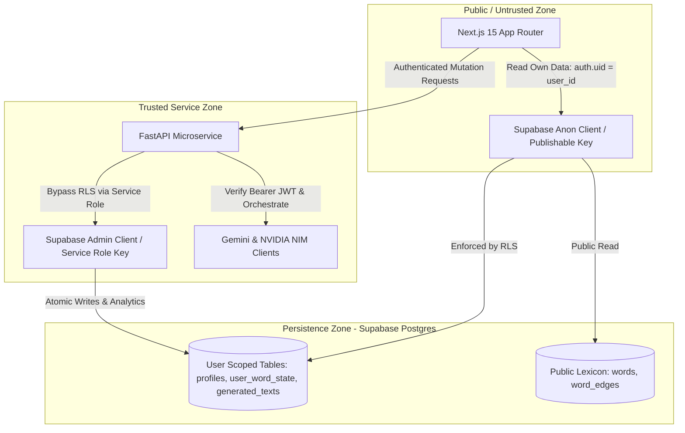

# ADR-004: Defense-in-Depth Security — Row-Level Security (RLS) & Backend Proxy Isolation

## Status
**Accepted**

## Context
Educational and AI applications handle sensitive user state: learning progress, proficiency ratings, reading history, and billing plans. Two common security failure modes exist:
1. **Direct Client Write Vulnerabilities**: Allowing client SPAs (e.g. Next.js in the browser) direct write access to database tables enables malicious users to forge mastery scores or bypass subscription gating.
2. **Exposed Administrative Keys**: Storing database administrative credentials (e.g., Supabase `service_role` key) in client bundles or public repositories.

## Decision
We implemented a **Defense-in-Depth Zero-Trust Boundary** with strict client/server demarcation:

### Core Tenets of the Security Architecture
1. **Client Isolation**:
   - The frontend is issued **only** the Supabase Public/Publishable Anon Key.
   - All user data tables (`profiles`, `user_word_state`, `generated_texts`, `generated_text_words`, `text_ratings`) have Postgres **Row Level Security (RLS) enabled**.
   - Read policies strictly evaluate `auth.uid() = user_id`.
   - `UPDATE` and `DELETE` policies on client connections are disabled by default.
2. **Backend Proxy Isolation**:
   - The Supabase `service_role` key is strictly confined to the backend server environment variables (`.env`).
   - All state mutations (e.g., mastery recalculations, reading session logs, batch onboarding completions) must route through authenticated FastAPI endpoints.
3. **Defense Against Client Tampering**:
   - Users cannot manually inflate their `mastery_score` or forge `generated_texts` because the client has no direct SQL `INSERT`/`UPDATE` permissions on these tables.

## Consequences

### Positive
- **Tamper-Proof Progression**: Mastery scores and CEFR calibrations cannot be spoofed from browser developer tools.
- **Zero Key Leakage Risk**: Service role secret key never touches the browser bundle or edge network.
- **Compliance Ready**: Enforces GDPR/data privacy principles by strictly isolating user records at the database engine level.

### Negative / Trade-offs
- **Architectural Separation**: Requires maintaining FastAPI backend endpoints for mutations rather than using 100% direct Supabase client SDK calls.
