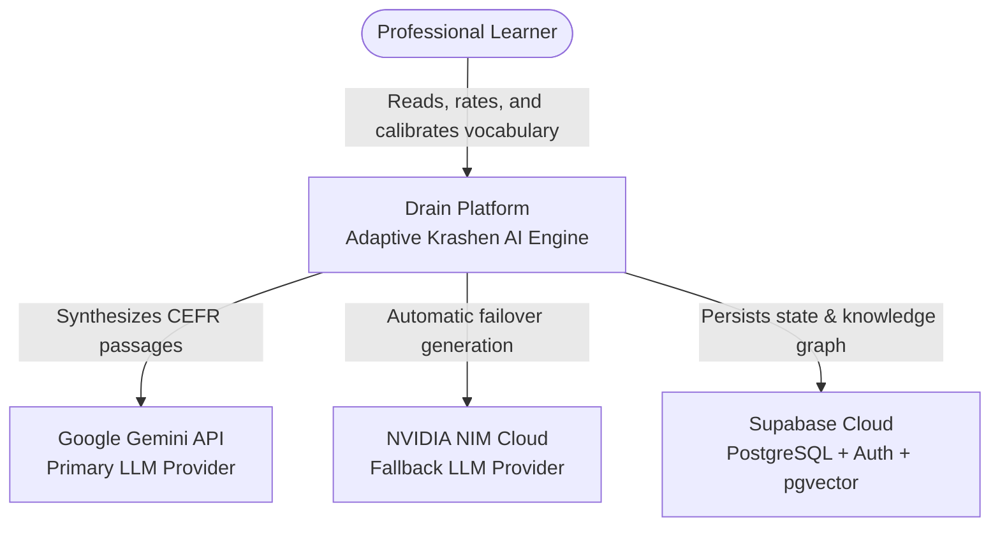
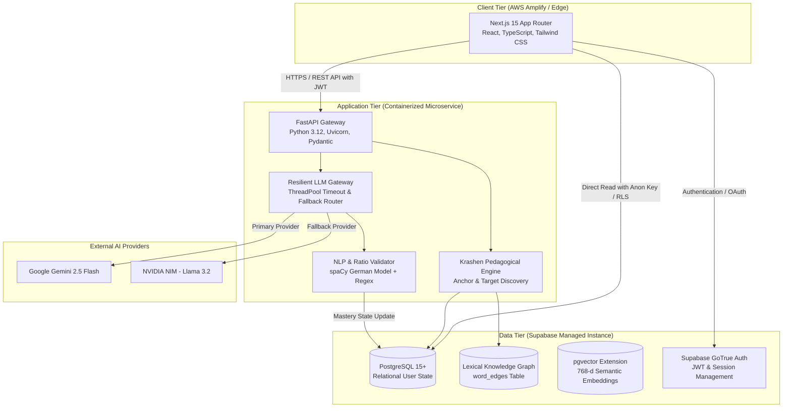
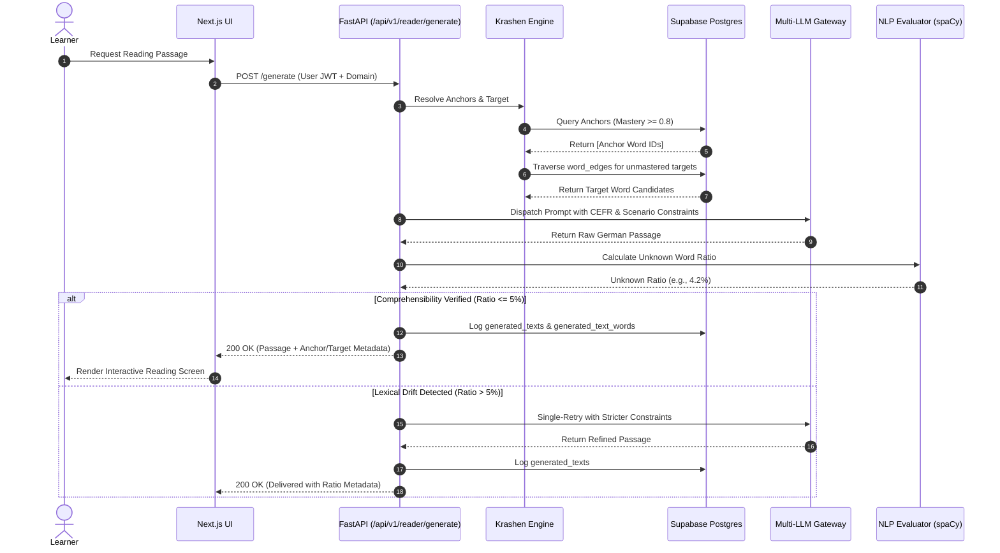

# System Architecture & Design Document: Drain Engine

## 1. Executive Summary

**Drain** is an adaptive, domain-specific AI reading platform engineered to prepare international professionals for the German Professional Language Examination (*Fachsprachenprüfung*) across **Healthcare (Pflege, Medizin, Physiotherapie)**, **Information Technology**, and **Academia**.

Unlike traditional vocabulary flashcard tools that promote rote memorization, Drain applies **Stephen Krashen’s Comprehensible Input Hypothesis ($i+1$)** and **Paul Nation’s 95% Lexical Threshold**. The platform continuously analyzes a user's known vocabulary map, identifies optimal learning vectors in a lexical knowledge graph, and dynamically prompts generative LLMs to synthesize authentic, CEFR-calibrated professional passages where ~95% of words are known and exactly target items ($+1$) are naturally embedded.

---

## 2. High-Level Architecture (C4 Model)

### 2.1 System Context (Level 1)



### 2.2 Container Architecture (Level 2)



---

## 3. Core Processing Pipelines

### 3.1 Adaptive Generation Flow

The reading text generation lifecycle executes in 6 deterministic stages:



---

## 4. Taxonomy & Domain Hierarchy

To eliminate taxonomy duplication and guarantee domain relevance, all domains and subdomains adhere to a strict single-source-of-truth specification:

| Primary Domain | Subdomain | Target Vocab Scope | Target Exam / Use Case |
|---|---|---|---|
| `HEALTH` | `PFLEGE` | Nursing terminology, shifts, wound care, vitals | *Fachsprachenprüfung Pflege* |
| `HEALTH` | `MEDIZIN` | Medical history (*Anamnese*), diagnostics, rounds, surgery | *Fachsprachenprüfung Medizin* |
| `HEALTH` | `PHYSIOTHERAPIE` | Rehabilitation, manual therapy, mobilization | *Anerkennung Physiotherapie* |
| `HEALTH` | `PHARMAZIE` | Prescription verification, interactions, counseling | *Fachsprachenprüfung Pharmazie* |
| `IT` | *Core IT* | Code reviews, incident response, sprints, system design | Technical interviews & daily work |
| `ACADEMIC` | *General Academic*| Seminar debates, thesis defense, methodology, citations | DSH / TestDaF & university studies |
| `CORE` | *General CEFR* | A1–B1 Foundation lemmas (Goethe / Telc standards) | Universal scaffolding |

---

## 5. CEFR Level Tuning Matrix

The generation engine dynamically calibrates prompts using strict syntactic and lexical bounds:

```python
LEVEL_CONFIG = {
    "A1": {
        "sentences": "3-4",
        "words": "25-40",
        "target_uses": "1 Mal",
        "anchors": 2,
        "grammar": "Nur Hauptsätze im Präsens. Sehr kurze Sätze (max. 8-10 Wörter). Keine Konjunktive, keine Passivformen."
    },
    "A2": {
        "sentences": "4-5",
        "words": "40-60",
        "target_uses": "1 Mal",
        "anchors": 2,
        "grammar": "Hauptsätze und einfache Nebensätze mit 'weil', 'dass', 'wenn'. Präsens und Perfekt."
    },
    "B1": {
        "sentences": "5-7",
        "words": "60-90",
        "target_uses": "1-2 Mal",
        "anchors": 3,
        "grammar": "Nebensätze, Relativsätze, Präteritum bei 'sein/haben'. Konnektoren wie 'deshalb', 'trotzdem'."
    },
    "B2": {
        "sentences": "6-8",
        "words": "90-130",
        "target_uses": "1-2 Mal",
        "anchors": 3,
        "grammar": "Komplexere Strukturen: Konjunktiv II, Passiv, indirekte Rede. Klar und lesbar."
    },
    "C1": {
        "sentences": "7-10",
        "words": "120-180",
        "target_uses": "2 Mal",
        "anchors": 3,
        "grammar": "Anspruchsvolle Syntax, Nomen-Verb-Verbindungen, idiomatische Wendungen."
    }
}
```

---

## 6. Service-Level Objectives (SLOs) & Non-Functional Requirements

| Metric | Target SLA | Implementation Strategy |
|---|---|---|
| **P95 Latency (Generation)** | $\le 3.5\text{ seconds}$ | ThreadPool execution, lightweight system prompts, Gemini 2.5 Flash |
| **Availability** | $\ge 99.9\%$ | Multi-provider failover (Gemini primary $\rightarrow$ NVIDIA NIM secondary) |
| **Comprehensibility Ratio** | $95\% \pm 3\%$ | Automated lemma-ratio validation loop via spaCy |
| **Data Isolation** | $100\%$ Zero-leakage | PostgreSQL Row Level Security (RLS) on all user tables |
| **Token Efficiency** | $\le 650$ total tokens/req | Compact system prompts and deterministic few-shot structure |
