# Token Economics, Cost Optimization & Latency Blueprint

## 1. Executive Summary

In AI-driven educational software, unmanaged token consumption and unoptimized LLM prompting represent the single highest operational risk. This blueprint details the mathematical modeling, token budgeting, unit economics, and infrastructure cost projections for the **Drain** architecture.

By utilizing concise few-shot prompt templates, deterministic level constraints, and high-efficiency models (**Google Gemini 2.5 Flash** as primary and **NVIDIA NIM Llama-3.2** as fallback), Drain achieves an ultra-low cost profile of **~$0.00016 per generated text** and **~$0.015 per active user per month**.

---

## 2. Token Budgeting per Request

Each reading passage generation follows a strict prompt structure calibrated across CEFR levels:

### 2.1 Prompt Breakdown

| Component | Content / Role | Average Input Tokens | Output Tokens |
|---|---|---|---|
| **System Prompt** | DaF author persona + Krashen $i+1$ pedagogical framing | ~50 tokens | — |
| **Few-Shot Exemplar** | 1 ideal input-output reference pair (B1 target word) | ~90 tokens | — |
| **Dynamic Constraints** | Level, domain scenario, narrative perspective, grammar rules | ~120–160 tokens | — |
| **Anchors & Target Lemma** | 2–3 known anchor words + 1 unmastered target word | ~40 tokens | — |
| **Generated Output** | German reading passage ($25\text{ words (A1)}$ to $180\text{ words (C1)}$) | — | ~60–180 tokens |
| **Total per Generation** | | **~300–340 Input Tokens** | **~60–180 Output Tokens** |

---

## 3. Unit Economics & Provider Pricing Matrix

*(Based on standard enterprise API tier rates)*

| Model | Role | Input Cost (per 1M tokens) | Output Cost (per 1M tokens) | Cost per Average Generation (~320 in / 120 out) |
|---|---|---|---|---|
| **Google Gemini 2.5 Flash** | Primary ($>95\%$ traffic) | $\$0.075$ | $\$0.300$ | **$\$0.000060$** ($\approx 0.006\text{ cents}$) |
| **NVIDIA NIM (Llama 3.2 11B)** | Fallback ($<5\%$ traffic) | $\$0.100$ | $\$0.200$ | **$\$0.000056$** ($\approx 0.0056\text{ cents}$) |
| **Weighted Average Cost** | Blended Gateway | — | — | **$\mathbf{\$0.000061}$** per passage |

> [!NOTE]
> Even with closed-loop validation triggering a single retry on $15\%$ of initial attempts, the blended average cost per completed reading session remains under **$\$0.000075$** ($0.0075\text{ cents}$).

---

## 4. User Lifecycle Economics & DAU Scale Projections

### 4.1 Usage Assumptions
- **Typical Learner Activity**: 3 dynamic reading texts per day + 1 onboarding calibration batch (3 texts).
- **Monthly Consumption per Active User**: $3 \text{ texts/day} \times 30 \text{ days} = 90 \text{ texts/month}$.
- **Monthly Inference Cost per User**: $90 \times \$0.000075 = \mathbf{\$0.00675 \text{ / user / month}}$ (less than 1 cent).

### 4.2 Scale Projections

| Active Users (DAU) | Daily Text Generations | Monthly LLM API Cost | Supabase Pro DB & Compute | Total Estimated Infra Cost / Mo | Infra Cost per User / Mo |
|---|---|---|---|---|---|
| **1,000 DAU** | 3,000 / day | $\$6.75$ | $\$25.00$ | **$\$31.75$** | $\$0.031$ |
| **10,000 DAU** | 30,000 / day | $\$67.50$ | $\$50.00$ | **$\$117.50$** | $\$0.011$ |
| **100,000 DAU** | 300,000 / day | $\$675.00$ | $\$200.00$ (Dedicated) | **$\$875.00$** | $\$0.0087$ |
| **1,000,000 DAU**| 3,000,000 / day | $\$6,750.00$ | $\$1,200.00$ (Clustered) | **$\$7,950.00$** | $\$0.0079$ |

---

## 5. Latency SLA & Optimization Strategy

```mermaid
gantt
    title Typical Generation Latency Budget (Target P95 <= 3.5s)
    dateFormat X
    axisFormat %s s

    section Backend
    Auth & Token Validation     : 0, 50
    Anchor & Graph Traversal   : 50, 120
    Prompt Assembly            : 120, 140
    
    section Upstream LLM
    Gemini 2.5 Flash TTFT & Gen: 140, 1800
    
    section Validation & DB
    spaCy Lemmatizer Check     : 1800, 1840
    PostgreSQL State Mutation  : 1840, 1920
    JSON Serialization & Wire  : 1920, 1960
```

### Key Latency Levers
1. **Model Selection**: Gemini 2.5 Flash delivers sub-second Time-to-First-Token (TTFT) for concise German texts.
2. **Lean Lemmatization**: Utilizing lightweight German regex tokenization and lemma caching ensures ratio calculations complete in $<40\text{ms}$.
3. **Connection Pooling**: Reusing `AsyncClient` connections for Supabase and LLM endpoints removes TCP/TLS handshake latency overhead on every request.
