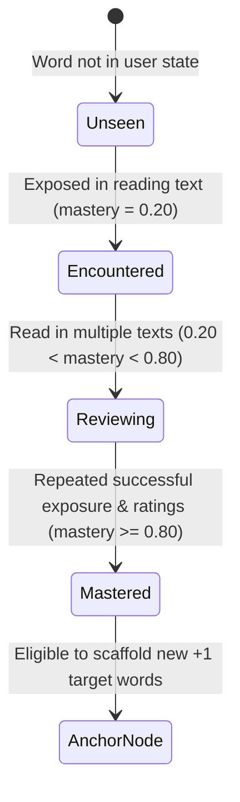

# Pedagogical Engine Specification: Krashen ($i+1$) & 95% Rule

## 1. Scientific Foundations

The pedagogical architecture of **Drain** translates decades of second language acquisition (SLA) empirical research into an automated algorithmic pipeline:

### 1.1 Stephen Krashen’s Comprehensible Input Hypothesis ($i+1$)
- **Core Premise**: Language acquisition occurs when a learner is exposed to messages that are understandable, yet contain grammatical structures and lexical items that are slightly beyond their current level of competence ($i+1$).
- **Algorithmic Translation**:
  - $i$ = The learner's verified high-mastery vocabulary pool ($\text{Mastery} \ge 0.80$, dubbed **Anchor Words**).
  - $+1$ = Exactly one unmastered target word connected to known anchors in the domain knowledge graph (**Target Word**).

### 1.2 Paul Nation’s 95% Lexical Coverage Rule
- **Core Premise**: For unassisted, fluent reading comprehension, at least **95% to 98%** of running words in a text must be recognized by the learner. When unknown word density exceeds 5%, reading turns into arduous deciphering, causing cognitive overload and abandonment.
- **Algorithmic Translation**:
  $$\text{Unknown Word Ratio} = \frac{|\{w \in \text{Passage} \mid w \notin \text{Learner Known Lemmas}\}|}{|\text{Passage}|} \le 0.05$$

### 1.3 The Direct Method (No Translation Crutch)
- **Core Premise**: Translation into native languages creates dependency and hinders spontaneous target-language recall.
- **Algorithmic Translation**: No foreign-language translations are generated or stored. When hints are requested, Drain provides contextual German glosses (`german_gloss`) and authentic German usage patterns (`usage_note_de`).

---

## 2. Dynamic Word State & Mastery Model

A learner's relationship with each vocabulary lemma is represented in `user_word_state` via a continuous score $\in [0.0, 1.0]$:

### Mastery Decay & Increment Algorithm
- **Positive Exposure**: Each reading session where the user rates understanding ($4–5\text{ stars}$) increments mastery by $+0.15$ up to $1.00$.
- **Difficult Encounter**: Low user comprehension ratings ($1–2\text{ stars}$) trigger reinforcement passes and adjust exposure weights.
- **Anchor Eligibility**: Only lemmas with $\text{Mastery} \ge 0.80$ serve as anchors for graph-based discovery of new target words.
